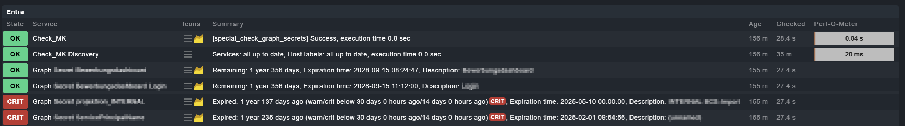

# check_graph_secrets

Checkmk special agent that monitors the expiration of Microsoft Entra app
registration client secrets via the Microsoft Graph API, so you can rotate
them before they expire and cause an outage.

Requires Checkmk **2.3** or newer (Checkmk plug-in API v2 / Server Side Calls
API v1 / Ruleset API v1). Tested and running in production on Checkmk 2.3.

## What it does

- Queries `GET /v1.0/applications` in the configured Entra tenant.
- For every app registration with at least one client secret
  (`passwordCredentials`), creates one Checkmk service: **Graph Secret
  \<app name\>**.
- The service reports the remaining validity of the secret that expires
  next (WARN/CRIT thresholds configurable, default 30 / 14 days), plus
  details for all of the app's secrets in the service details.
- The special agent's own app registration is a normal app registration
  too, so once set up it monitors its own secret's expiration as well.

Certificates (`keyCredentials`) and federated credentials are intentionally
out of scope for this check.

### What it looks like

Service list for a monitored tenant — most secrets fine, some already
overdue for rotation (app names redacted, everything else is real output):



## Step 1: Create the Microsoft Entra app registration

Create a **dedicated** app registration used only by this special agent
(don't reuse an existing one — keep its blast radius minimal and its
purpose obvious to other admins).

1. [Entra admin center](https://entra.microsoft.com) → **App registrations**
   → **New registration**.
   - Name: something identifiable, e.g. `checkmk-graph-secrets-monitor`.
   - Supported account types: **Accounts in this organizational directory
     only** (single tenant).
   - Redirect URI: leave empty — this agent authenticates via the
     client-credentials flow (app-only, non-interactive), no redirect is
     used.
2. On the app's **Overview** page, note down:
   - **Application (client) ID**
   - **Directory (tenant) ID**
3. **Certificates & secrets → Client secrets → New client secret**.
   - Pick an expiry per your org's secret policy.
   - Copy the **Value** immediately after creation — it is never shown
     again. This is what goes into the Checkmk rule's "Client secret"
     field.
4. **API permissions → Add a permission → Microsoft Graph → Application
   permissions** (not Delegated — this is unattended/daemon auth) →
   search and select `Application.Read.All` → **Add permissions**.
5. Click **Grant admin consent for \<your org\>** (requires Global
   Administrator / Privileged Role Administrator / Application
   Administrator). Without this step, the agent fails with HTTP 403.

`Application.Read.All` is intentionally tenant-wide read access — the
check needs to see **all** app registrations in the tenant, not just its
own, so there is no narrower Graph permission that fits.

## Step 2: Install the plug-in on the Checkmk site

Two options; pick one.

### Option A — git clone + symlink (recommended while iterating)

The repo is public, so a plain HTTPS clone works, no key needed. On the
Checkmk server, as the **site user**:

```bash
mkdir -p ~/git && cd ~/git
git clone https://github.com/sebfeldm/checkmk.git
```

(If you'd rather use SSH — e.g. the repo goes private again later —
generate a deploy key on the server and add it as a **read-only** key
under Settings → Deploy keys on the GitHub repo:
```bash
ssh-keygen -t ed25519 -C "checkmk-<site>-deploy" -f ~/.ssh/id_ed25519_checkmk -N ""
cat ~/.ssh/id_ed25519_checkmk.pub   # paste this whole line as the deploy key
cat >> ~/.ssh/config <<'EOF'
Host github.com
    IdentityFile ~/.ssh/id_ed25519_checkmk
    IdentitiesOnly yes
EOF
chmod 600 ~/.ssh/config
```
then clone `git@github.com:sebfeldm/checkmk.git` instead.)

Optional: this clone doesn't need the built `.mkp` files under
`releases/` in its working tree (they're only there for people who want
to `wget` one directly from GitHub). Keep them out of this checkout with:
```bash
cd ~/git/checkmk
git sparse-checkout init --no-cone
printf '/*\n!/releases/\n' > .git/info/sparse-checkout
git sparse-checkout reapply
```

Then symlink this plug-in folder into place:

```bash
ln -s ~/git/checkmk/special_agents/check_graph_secrets \
      ~/local/lib/python3/cmk_addons/plugins/check_graph_secrets
```

**Update process:** `cd ~/git/checkmk && git pull`, then reload (see
below). No repackaging needed.

### Option B — install the .mkp

Prebuilt packages are published as
[GitHub Releases](https://github.com/sebfeldm/checkmk/releases) (built
with [`scripts/build_mkp.py`](../../scripts/build_mkp.py) — no Checkmk
site needed to build it, pure Python stdlib) and also kept in
[`releases/`](../../releases/) at the repo root. Grab one directly, no
auth needed since the repo is public:

```bash
wget https://github.com/sebfeldm/checkmk/releases/download/check_graph_secrets-v1.0.0/check_graph_secrets-1.0.0.mkp
```

Then either:

- **Setup → Maintenance → Extension packages → Upload package**, or
- on the server: `mkp install check_graph_secrets-1.0.0.mkp`

Use this if you want a Checkmk-version-tracked, enable/disable-able
package instead of a live git symlink (e.g. distributing to a site you
don't manage directly).

### Reload after install/update (either option)

```bash
cmk-validate-plugins
cmk -U && omd restart
```

`cmk-validate-plugins` catches syntax/API problems before they hit the
running site. `cmk -U && omd restart` makes sure both the GUI (rule
forms) and the check engine pick up the change — a plain `omd restart
apache` is sometimes enough for GUI-only changes, but the full restart is
cheap and avoids guessing.

## Step 3: Configure in Checkmk

1. **Setup → Hosts → Add host.** Create a host representing the Entra
   tenant, e.g. `Entra`.
   - **IP address family: No IP** — this host isn't a real network device.
   - Leave **Checkmk agent / API integrations** at its default (do **not**
     set it to *"No API integrations, no Checkmk agent"* — that option
     explicitly disables special agents too, and the agent will silently
     never run; see Troubleshooting below).
2. **Setup → Agents → VM, cloud, container → Microsoft Graph app secrets.**
   (Special agents in the `Cloud` topic are filed under **"VM, cloud,
   container"**, not "Other integrations" — easy to miss.)
   - Add rule, assign it to the `Entra` host (Conditions → Explicit hosts).
   - Fill in **Tenant ID**, **Client ID**, **Client secret** from step 1.
   - **Watch out for browser autofill**: on at least one occasion a
     password manager silently overwrote the Tenant ID field with an
     unrelated saved value on save. After saving, reopen the rule and
     visually confirm the Tenant ID is still the real 36-character GUID,
     not something else.
3. **Activate changes** (top-right orange button) — required after
   creating the host *and* after every rule change, or nothing takes
   effect.
4. On the host page: **Save & run service discovery**, then **Accept
   all**.

Optionally, adjust thresholds/exclusions under **Setup → Service
monitoring rules → Microsoft Graph App Secrets** (see Thresholds below).

## Thresholds

Default (`check_graph_secrets_params` ruleset, parameter "Secret
expiration"):

- **WARN** when a secret's remaining validity drops below **30 days**.
- **CRIT** when it drops below **14 days** (including already expired).

Change these, or exclude specific secrets by regex (**"Exclude
secrets"**), under **Setup → Service monitoring rules → Microsoft Graph
App Secrets**.

## Troubleshooting

Symptoms seen during initial rollout, in case they recur (e.g. on another
site or after a Checkmk upgrade):

- **Rule doesn't show up anywhere under "Other integrations".** It's
  filed under **"VM, cloud, container"** instead — that's where
  `Topic.CLOUD` special agents are categorized in this Checkmk version.
- **`cmk -d <host>` / `cmk --debug -v -d <host>` print nothing at all, no
  error.** Check the host's **Checkmk agent / API integrations** setting —
  if it's set to *"No API integrations, no Checkmk agent"*, the special
  agent is never invoked. Pick an option that keeps API integrations
  enabled.
- **Same empty-output symptom, but API integrations are enabled.** Check
  whether the Tenant ID field actually contains the real GUID — open the
  rule and look, don't trust what you typed. Browser autofill has been
  observed silently replacing it.
- **Host's built-in "Test connection" page shows everything red.** That
  page only tests Ping/Agent(TCP)/SNMP/Traceroute, none of which apply to
  a No-IP host with a special agent — red here is expected and not a
  useful signal for this check. Use `cmk -d <host>` instead.
- **General diagnostic sequence** that surfaces real errors:
  `cmk-validate-plugins` (plug-in loading/API errors) →
  `cmk --debug -v -d <host>` (special agent's actual stdout, or a Python
  traceback if it crashed) → `cmk --debug -II <host>` (forces
  rediscovery with full traceback on parse errors).
